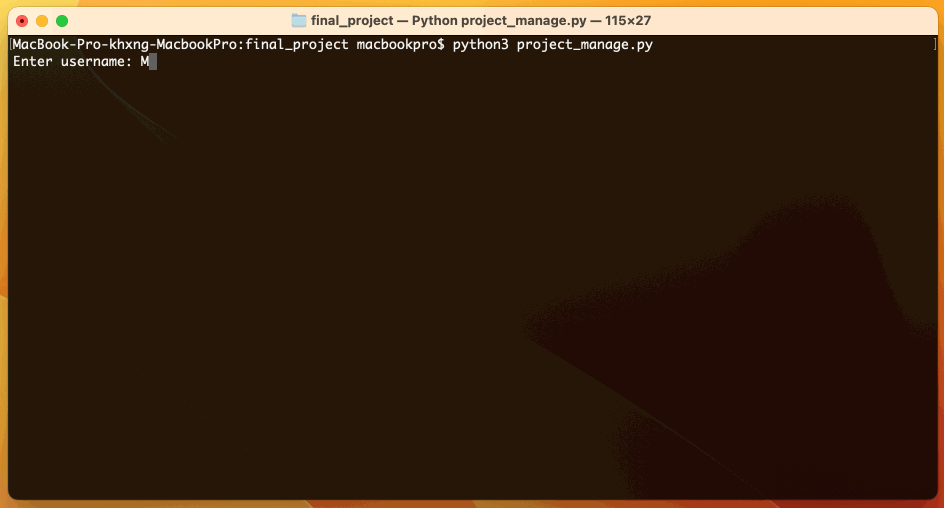
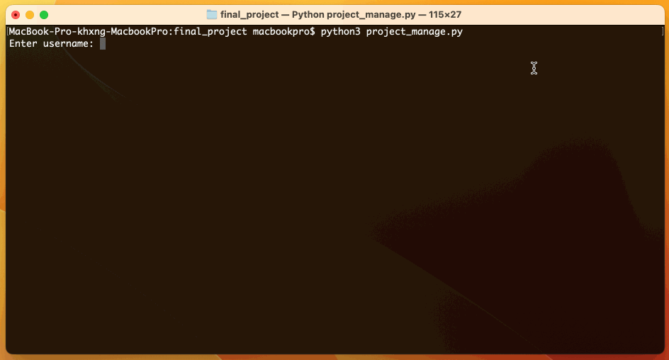
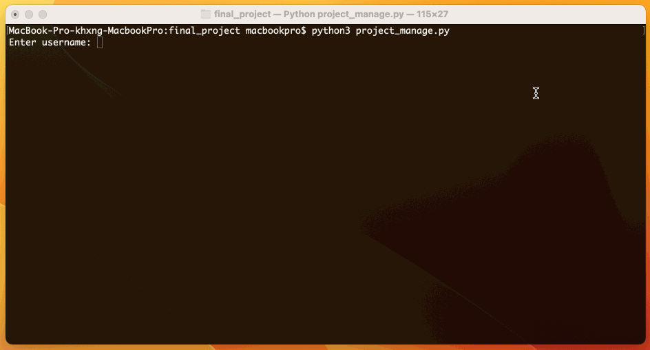
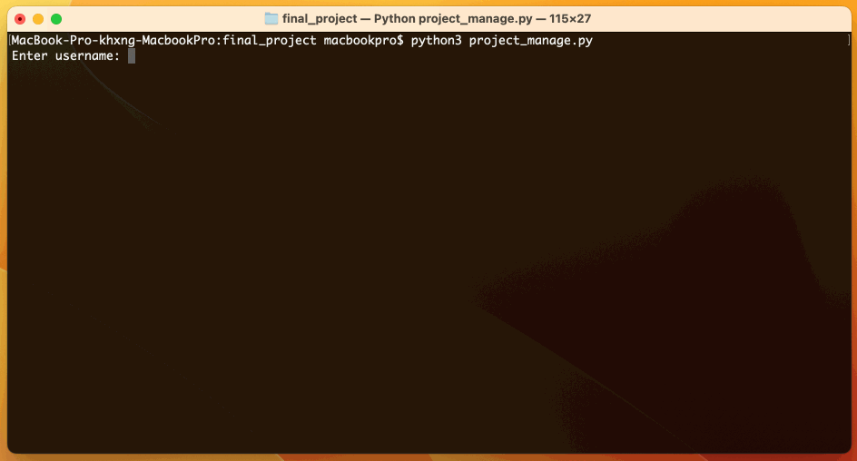

# Project Manage

## Example

### Lead

### Member 1

### Member 2

### Advisor

### Faculty

## How to run my project?
- First, you have to see `username` and `password` in `login.csv` file.
- Second, you have to login as `student` with `username` and `password`.
- Third, after you have login then you have to create project, invite `member`, and invite `advisor`.
- Fourth, you can login as `member`(you can see who is `member` in `login.csv` file, the role will be updated), then you can accept or reject the request from `lead`.
- Fifth, you can login as `advisor`(you can see who is `member` in `login.csv` file, the role will be updated), then you can accept or reject the request from `lead`.
- Sixth, if you login as `advisor` or faculty, then you can evaluation the project.
- Seventh, if `advisor` or faculty have reject your project more than 2 people, then you can login as `lead` and then you can edit project. 

## A table detailing each role and its actions
| Role    | Action                                                                                                                                                                     | Method                   | Class         | Completion percentage |
|---------|----------------------------------------------------------------------------------------------------------------------------------------------------------------------------|--------------------------|---------------|-----------------------|
| Admin   | has access to the person's data in the system                                                                                                                              | view_all_person          | ProcessMember | 100%                  |
|  Admin  | Other users can be added to the system after adding a person, the data will be in the format specified in `login.csv`.                                                     | new_person               | ProcessMember |  100%                 |
|  Admin  | If a `admin` modifies a person's data in the system, `login.csv` will also receive the updated information.                                                                | edit_person              | ProcessMember |  100%                 |
|  Admin  | If an individual is deleted from the system, the information in `login.csv` will also be changed.                                                                          | delete_person            | ProcessMember |  100%                 |
| Student | Make a project.                                                                                                                                                            | create_project           | ProcessMember |  100%                 |
| Student | Forward the invitation request message to additional `student`.                                                                                                            | invite_member            | ProcessMember |  100%                 |
| Student | Forward the message inviting `faculty` to serve as my `advisor`.                                                                                                           | invite_advisor           | ProcessMember |  100%                 |
| Student | student` will take over the job of `lead` after they have completed the assignment.                                                                                        | change_role              | ProcessMember |  100%                 |
| Member  | Select `yes` or `no` to accept the project invitation from the `lead` project.                                                                                             | response_request_project | ProcessMember |  100%                 |
| Member  | member` can read the project's details if they accept the request.                                                                                                         | view_project             | ProcessMember |  100%                 |
| Member  | if `member` declines the request, `member` will revert to the role of `student` and be able to perform the same tasks as the `student` role.                               |  change_role             | ProcessMember |  100%                 |
| Lead    | `lead` has access to the project's details                                                                                                                                 | view_project             | ProcessMember |  100%                 |
| Lead    | The project can be edited by `lead`                                                                                                                                        | edit_project             | ProcessMember |  90%                  |
| Lead    | The project can be deleted by `lead` in the view project's `lead`                                                                                                          | delete_project           | ProcessMember |  100%                 |
| Lead    | `lead` has the can to view each `member`'s `status`. If a `member` has replied, response_date will be displayed; if not, response_date will read `waiting for answer...`.  | view_member              | ProcessMember |  100%                 |
| Lead    | `lead` has the can to view each `advisor`'s `status`. If a `member` has replied, response_date will be displayed; if not, response_date will read `waiting for answer...`. | view_advisor             | ProcessMember |  100%                 |
| Advisor | Select `yes` or `no` to accept the project invitation from the `lead` project.                                                                                             | response_request_project | ProcessMember |  100%                 |
| Advisor | `advisor` can read the project's details if they approve the request                                                                                                       | view_project             | ProcessMember |  100%                 |
| Advisor | `advisor` has access to every project.                                                                                                                                     | view_all_projects        | ProcessMember |  100%                 |
| Advisor | `advisor` has access to evaluate every project.                                                                                                                            | evaluation_projects      | ProcessMember |  100%                 |
| Faculty | `faculty` has access to every project.                                                                                                                                     | view_all_projects        | ProcessMember |  100%                 |
| Faculty | `advisor` has access to evaluate every project.                                                                                                                            | evaluation_projects      | ProcessMember |  100%                 |

## Database.py
- This code is a Python implementation of a simple database system that uses CSV files as tables. It provides functions for creating tables, inserting and retrieving data, updating and deleting rows, and querying the data in the tables.

    - `get_persons(filename_csv="persons.csv")`: This function reads data from a CSV file and returns a list of dictionaries, where each dictionary represents a row in the CSV file.
    - `create_csv(filename: str, fieldname: list)`: This function creates a new CSV file with the specified filename and fieldnames as the header row.
    - `insert_csv(filename: str, fieldname: list, row_data: dict)`: This function inserts a new row of data into an existing CSV file.
    - `query_read_csv(filename: str) -> list`: This function reads all the rows from a CSV file and returns them as a list of dictionaries.
    - `get_read_csv(filename: str, id: str, field_id: str) -> dict`: This function reads a specific row from a CSV file based on the provided id and field_id.
    - `filter_read_csv(filename: str, id: str, field_id: str)`: This function reads all the rows from a CSV file that match the provided id and field_id and returns them as a list of dictionaries.
    - `delete_csv(filename: str, id: str, field_id: str, fieldname: list)`: This function deletes a specific row from a CSV file based on the provided id and field_id.
    - `update_csv(filename: str, id: str, field_id: str, dict_data: dict, fieldname: list)`: This function updates a specific row in a CSV file based on the provided id and field_id with the values from the dict_data.
    - `Database`: This class represents a database and contains a list of tables. It provides methods for creating tables and adding rows to them.
    - `Table`: This class represents a table within a database. It has methods for adding fields, adding rows of data, retrieving data, updating rows, and deleting rows.

## ProcessMember.py
- The ProcessMember class is used for processing member data.

    -  `def check_request_project(self) -> bool:`
        The function `check_request_project` checks if a member or advisor has a pending request to join
        a project. Returns:a boolean value. If the condition is met, it returns True. Otherwise, it returns False.
    -  `def change_role(self, new_role: str, data_user: dict):`
        The function `change_role` updates the role of a user in a database table.
        Args:new_role (str): The new_role parameter is a string that represents the new role that you want
        to assign to the user.data_user (dict): The `data_user` parameter is a dictionary that represents a user's data. It
        contains information such as the person's ID, username, password, and role.
    -   `def invite_member(self, name) -> str:`
        The function `invite_member` selects a member from a login table based on their role being
        "student" and returns their username.
        :return: a string, which is the username of the selected member 1.
    -   `def invite_advisor(self, name) -> str:`
        The function `invite_advisor` selects and invites a faculty member to become an advisor for a
        specific person.   
        Args:name: The parameter "name" in the "invite_advisor" function is a string that represents the
        name of the person you want to invite as an advisor.       
        Returns: the person_id of the advisor who was invited, or None if no advisor was selected.
    -   `def send_request(self, role_name, data_user):`
        The `send_request` function sends a request to either add a member or an advisor to a project,
        storing the request details in the appropriate table.        
        Args:role_name: The role_name parameter is a string that specifies the role of the user making the
        request. It can be either "member" or "advisor".
        data_user: The `data_user` parameter is a dictionary that contains information about the user.
        It likely includes the user's ID, name, and other relevant details.
    -   `def create_project(self):`
        The `create_project` function prompts the user to enter a project title, retrieves data from a
        login table, generates a unique project ID, adds a new row to a project table with the project
        details, updates the user's role to "lead", and sends a request to students from the login
        table.
    -   `def view_project(self, show_toolbar=True):`
        The `view_project` function displays project details and provides options for navigation and
        project deletion.      
        Args: show_toolbar: The `show_toolbar` parameter is a boolean value that determines whether or not
        to display the toolbar options after printing the project details. If `show_toolbar` is `True`,
        the toolbar options will be displayed. If `show_toolbar` is `False`, the toolbar options will
        not be displayed. Defaults to True
    -   `def back_to_basic(self, person_id, new_role):`
        The function "back_to_basic" updates the role of a person in the login_table based on their
        person_id.
        Args: person_id: The `person_id` parameter is the unique identifier of the person whose role needs
        to be changed. new_role: The new_role parameter is the role that you want to assign to the person with the
        specified person_id.
    -   `def update_project(self) -> dict:`
        The `update_project` function updates the project details based on user input and returns a
        dictionary with the updated values.
        Returns: a dictionary with the updated project information. The dictionary includes the project ID,
        title, lead, member1, member2, advisor, and status.
    -   `def edit_project(self):`
        The `edit_project` function updates a project's information in the project table and deletes its
        evaluation data from the evaluation project table.
    -   `def delete_project(self):`
        The `delete_project` function deletes a project and updates the roles of the project lead and
        members in a database.
    -   `def response_request_project(self):`
        The function `response_request_project` handles the response to a project request, allowing the
        user to accept or decline the request and perform corresponding actions in the database.
    -   `def view_all_projects(self):`
        The function `view_all_projects` retrieves project data from a database and displays it in a
        formatted manner, allowing the user to navigate back to the menu or exit the program.
    -   `def evaluation_projects(self):`
        The `evaluation_projects` function allows a teacher to evaluate and approve or reject student
        projects.
        Returns: The function does not explicitly return anything.
    -   `def get_username(self,person_id):`
        The function `get_username` retrieves the username associated with a given person ID from a
        login table.
        Args: person_id: The `person_id` parameter is the unique identifier for a person in the database. It
        is used to retrieve the corresponding username from the login table.
        Returns: the username associated with the given person_id.
    -   `def view_advisor(self):`
        The function "view_advisor" is used to view an advisor.
    -   `def view_all_person(self):`
        The function "view_all_person" is used to view all the persons in a system.
    -   `def random_string(self,length):`
        The function generates a random string of a specified length.
        Args: length: The length parameter is an integer that specifies the desired length of the random
        string that will be generated.
    -   `def change_to_login(self,input_dict):`
        The function takes an input dictionary and transforms it into a login dictionary by renaming and
        reformatting certain keys and generating a random password.
        Args: input_dict: The input_dict is a dictionary that contains the following keys and values:
        Returns: an output dictionary with the keys "person_id", "username", "password", and "role". The values
        for these keys are obtained by modifying the values from the input dictionary. The "person_id"
        key is changed from "ID", the "username" key is changed from "fist" (presumably a typo and
        should be "first"), the "password" key
    -   `def new_person(self):`
        The function "new_person" is used to create a new person object.
    -   `def edit_person(self):`
        The function "edit_person" is used to modify the details of a person.
    -   `def delete_person(self):`
        The delete_person function is used to remove a person from a list or database.
    -   `def faculty_select_action(self):`
        The function `faculty_select_action` is used to perform an action selected by a faculty member.
    -   `def advisor_select_action(self):`
        The function advisor_select_action is used to select an action for the advisor.
    -   `def lead_select_action(self):`
        The function `lead_select_action` is used to perform an action for selecting a lead.
    -   `def member_select_action(self):`
        The function member_select_action is used to select an action for a member.
    -   `def student_select_action(self):`
        The function "student_select_action" is a method that allows a student to select an action.
    -   `def admin_select_action(self):`
        The function admin_select_action allows an admin user to select an action.
    -   `def select_action(self):`
        The function "select_action" is defined within a class.

## Project_manage.py
- The provided code initializes a database and handles the login process for different roles (admin, advisor, lead, student/member, faculty).

    - The `initializing()` function initializes the database by creating tables, populating them with data from a CSV file, and adding them to the database. It also sets up the login table with usernames, passwords, and roles.
    - The `login()` function prompts the user to enter a username and password. It then checks if the entered credentials match any entries in the login table of the database. If a match is found, it returns the person_id and role of the user; otherwise, it returns `None`.
    - The `initializing()` function is called to set up the database.
    - The user is prompted to enter their username and password using the `login()` function until valid credentials are provided.
    - Based on the role of the logged-in user, the `select_action()` method of the `ProcessMember` class is called to perform activities specific to that role.

